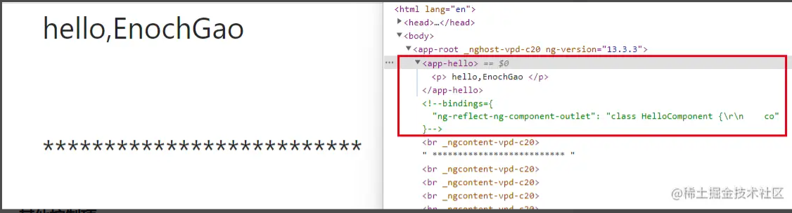
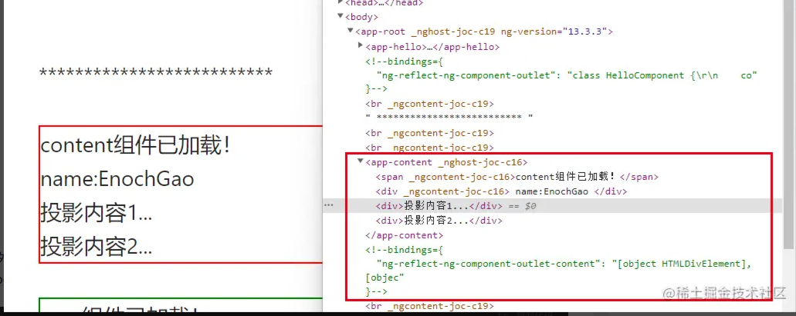
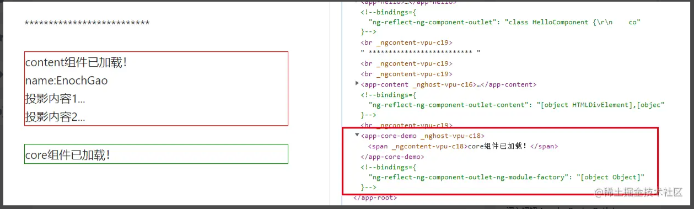

# ngComponentOutlet指令

## 前言

前提你已了解Angular框架的基本使用，知晓[指令](https://angular.cn/guide/built-in-directives)等相关概念及作用。

- ng版本：v13.3.x
- 源码：[地址](https://github.com/angular/angular/blob/13.3.x/packages/common/src/directives/ng_component_outlet.ts)

## 功能

`ngComponentOutlet`：实例化单个Component组件，并将其（宿主视图）插入到当前视图中。

## 用法

```ts
@Component({
  selector: 'app-hello',
  template: `
    <p>hello,EnochGao!</p>
  `,
  styles: []
})
export class HelloComponent{  // hello模板组件
}

@Component({
  selector: 'app-root',
  template: `
    <ng-container *ngComponentOutlet="component"></ng-container>
  `,
  styles: []
})
export class AppComponent{ // app组件
  component = HelloComponent; // 引用模板组件
}

```

效果图：


可以看到`ngComponentOutlet`指令将hello组件渲染到app组件中。

## 其他控制项

它还有一些其他配置项，可以精确实现组件的创建：

- `ngComponentOutletInjector`:可选的，自定义 Injector，将用作此组件的父级。默认为当前视图容器的注入器。
- `ngComponentOutletContent`:可选的，要插入到组件内容部分的可投影节点列表（如果存在）
- `ngComponentOutletNgModuleFactory`: 可选的，模块工厂允许动态加载其他模块，然后从该模块加载组件。（v14版本将会废弃，改用ngComponentOutletNgModule）

```ts
@Injectable()
export class NameService { // 一个服务
  myName = 'EnochGao';
}

@Component({
  selector: 'app-content',
  template: `
    <span>{{text}}</span>
    <div>
      name:{{nameService.myName}}
    </div>
    <ng-content></ng-content>
    <ng-content></ng-content>
  `,
  styles: [`
    :host{
      display:block;
      border:1px solid red;
    }
   `
  ]
})
export class ContentComponent { // content模板组件，依赖服务
  text = 'content组件已加载！';
  constructor(public nameService: NameService) { }
}


@Component({
  selector: 'app-root',
  template: `
  <ng-container *ngComponentOutlet="contentComponent;injector: myInjector;content: myContent">
  </ng-container>
  `,
  style: []
})
export class AppComponent { // app组件
  contentComponent = ContentComponent;
  myInjector: Injector;
  myContent: any[][];

  constructor(
    private injector: Injector,
    @Inject(DOCUMENT) private document: Document
  ) {
    const div1 = this.document.createElement('div');
    const text1 = this.document.createTextNode('投影内容1...');
    div1.appendChild(text1);

    const div2 = this.document.createElement('div');
    const text2 = this.document.createTextNode('投影内容2...');
    div2.appendChild(text2);

    this.myContent = [[div1], [div2]];
    this.myInjector = Injector.create({
    providers: [{ provide: NameService, deps: [] }],
    parent: this.injector
    });
  }
}

```

效果图：


此外我们还可以指定`ngComponentOutletNgModuleFactory`(v14版本中模块工厂会被删除，将会直接传递moduleRef)

```ts
@Component({
  selector: 'app-core-demo',
  template: `
    <span>{{text}}</span>
  `,
  styles: [`
    :host{
      display:block;
      border:1px solid green;
    }`
  ]
})
export class CoreDemoComponent { // core组件
  text = 'core组件已加载！';

}

@NgModule({
  declarations: [
    CoreDemoComponent
  ],
  imports: [
    CommonModule,
  ]
})
export class CoreModule { // core模块，注意后续我们不会将coreModule引入到AppModule中
// 看看是否会加载成功
}


@Component({
  selector: 'app-root',
  template: `
    <ng-container *ngComponentOutlet="coreComponent;ngModuleFactory:factory"></ng-container>
  `,
  style: []
})
export class AppComponent { // app组件
  coreComponent = CoreDemoComponent; // 引入core组件
  factory: NgModuleFactory<any>;

  constructor(
    private compiler: Compiler,
  ) {
   this.factory = this.compiler.compileModuleSync(CoreModule);
  }
}
```

效果图：



## 源码分析

```ts
@Directive({ selector: '[ngComponentOutlet]' })
export class NgComponentOutlet implements OnChanges, OnDestroy {
  @Input() ngComponentOutlet!: Type<any>;
  @Input() ngComponentOutletInjector!: Injector;
  @Input() ngComponentOutletContent!: any[][];
  @Input() ngComponentOutletNgModuleFactory!: NgModuleFactory<any>;

  private _componentRef: ComponentRef<any> | null = null;
  private _moduleRef: NgModuleRef<any> | null = null;

  constructor(private _viewContainerRef: ViewContainerRef) { }

  ngOnChanges(changes: SimpleChanges) {

    this._viewContainerRef.clear();
    this._componentRef = null;

    if (this.ngComponentOutlet) {
      const elInjector = this.ngComponentOutletInjector || this._viewContainerRef.parentInjector;

      if (changes['ngComponentOutletNgModuleFactory']) {
        if (this._moduleRef) {
          this._moduleRef.destroy();
        }

        if (this.ngComponentOutletNgModuleFactory) {
          const parentModule = elInjector.get(NgModuleRef);
          this._moduleRef = this.ngComponentOutletNgModuleFactory.create(parentModule.injector);
        } else {
          this._moduleRef = null;
        }
      }

       // 找到解析组件工厂
      const componentFactoryResolver = this._moduleRef ?
        this._moduleRef.componentFactoryResolver :
        elInjector.get(ComponentFactoryResolver);

      const componentFactory = componentFactoryResolver.resolveComponentFactory(this.ngComponentOutlet);

      this._componentRef = this._viewContainerRef.createComponent(
        componentFactory,
        this._viewContainerRef.length,
        elInjector,
        this.ngComponentOutletContent
      );
    }
  }

  ngOnDestroy() {
    if (this._moduleRef) {
      this._moduleRef.destroy();
    };
  }
}
```

其实代码的核心实现思路是：找到传入组件的`componentFactoryResolver`(组件工厂解析器)这个工厂对象，然后通过`ViewContainerRef`的createComponent方法，将组建渲染到视图容器中。至于传入模块工厂的方式:首先找到传入组件对应的模块引用，模块引用下有对应组件的组件工厂解析器。

可见`ViewContainerRef`这个类功能强大，`ngTemplateOutlet`模板渲染，最终也是通过它来创建的。

## 思维扩展

实际项目中是否存在动态加载组件的需求，比如一个广告位轮播功能（每一个广告是一个组件，通过`ngComponentOutlet`我们可以实现广告的动态轮播）。

## 总结

我们可以通过`ngComponentOutlet`指令的形式加载组件，而不是在模板中通过标签的形式加载。它可以实现通过代码进行灵活加载组件，将父组件与子组件进行解耦，符合开闭原则。
