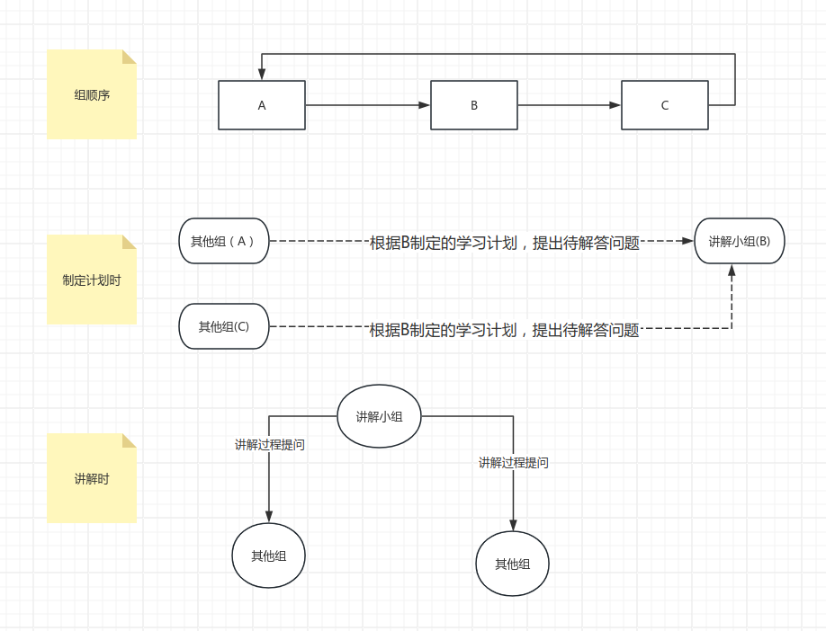

# 小组学习计划

## 计划安排

由讲解小组讲解分享学习内容，时间于每周 xx 下午 xxx 点进行

## 人员分组

| 组  | 组员 |
| --- | ---- |
| A   | xxx  |
| B   | xxx  |
| C   | xxx  |

## 讲解小组任务

要有产出成果物，讲解小组需要自己组织讲解形式，参考：

- 是否需要组长组织调配任务，谁来做
- 是否需要讲解人，谁来讲
- 是否需要成果物撰写，谁来写
- 是否需要分享内容任务安排，谁来安排
- 是否需要解答待解答问题，谁解答
- 是否需要宣讲过程提出问题，谁提问

等等形式小组自行安排组织

## 计划流程

各小组制定学习计划，填写到下面表格中（比如当前宣讲周是 A，B 小组要及时填写下周学习计划），其他小组填写相关待解答问题（下周讲解小组 B 需要解答），下周讲解小组组织安排小组任务。每期的学习任务其他小组也要进行学习，讲解小组需要在讲解过程中对其小组人员进行提问。

## 学习任务

### xxxx

| 期次（时间）  | 讲解小组 | 分享内容 | 待解答问题 |
| :-----------: | :------: | :------: | :--------: |
| 第一期（3-8） |    A     |   xxx    |     xx     |
