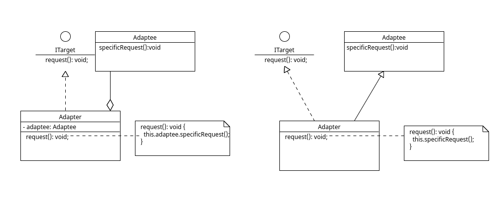

# 适配器模式 Adapter Pattern

## 定义

将一个接口转换成客户希望的另一个接口，适配器模式使接口不兼容的那些类可以一起工作

## 角色

1. 目标（Target）接口：当前系统业务所期待的接口，它可以是抽象类或接口。
2. 适配者（Adaptee）类：需要被适配的类。
3. 适配器（Adapter）类：它是一个转换器，通过继承或引用适配者的对象，把适配者接口转换成目标接口，让客户按目标接口的格式访问适配者

## 类图



## 解释

类模式：定义期望的抽象（Target）,适配器类（Adapter）实现这个抽象，然后继承需要被适配的类，方法中调用适配者类中的方法。

对象模式：适配器中含有被适配类的实例引用，然后调用被适配者的方法。

## 代码案例

```ts
// 目标抽象
interface ITarget {
  request(): void;
}

// 适配者（Adaptee）类：需要被适配的类
class Adaptee {
  specificRequest() {
    console.log('specificRequest');
  }
}

//  适配器（Adapter）类
class ClassAdapter extends Adaptee implements ITarget {
  request(): void {
    this.specificRequest();
  }
}

// 对象适配器
class ObjectAdapter implements ITarget {
  constructor(private adaptee: Adaptee) {}
  request(): void {
    this.adaptee.specificRequest();
  }
}

// client
()=>{
    const target: ITarget = new ClassAdapter();
    target.request();

    const targetObj: ITarget = new ObjectAdapter(new Adaptee());
    targetObj.request();
}()

// specificRequest
// specificRequest
```
