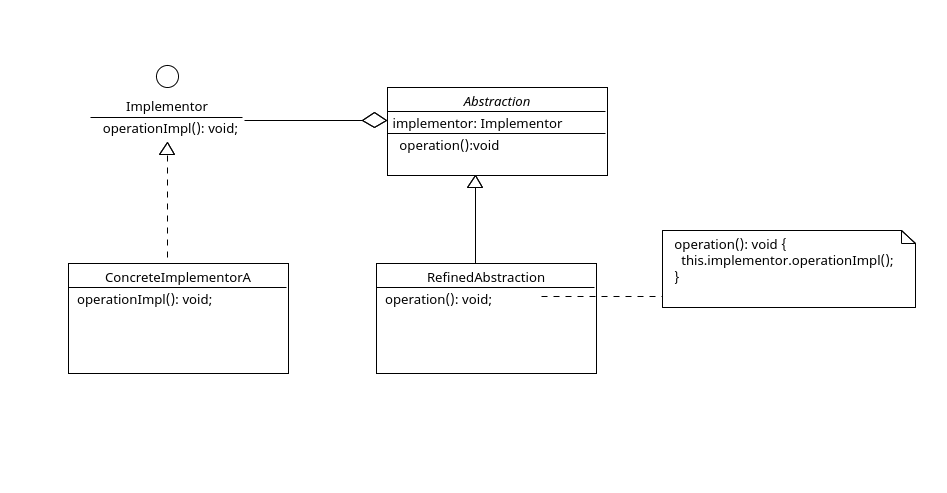

# 桥接模式 Bridge Pattern

## 定义

桥接模式(Bridge Pattern)：将抽象部分与它的实现部分分离，使它们都可以独立地变化。

## 角色

1. 抽象化（Abstraction）角色：定义抽象类，并包含一个对实现化对象的引用。
2. 扩展抽象化（Refined Abstraction）角色：是抽象化角色的子类，实现父类中的业务方法，并通过组合关系调用实现化角色中的业务方法。
3. 实现化（Implementor）角色：定义实现化角色的接口，供扩展抽象化角色调用。
4. 具体实现化（Concrete Implementor）角色：给出实现化角色接口的具体实现。

## 类图



## 解释

是一个比较常用的设计模式，它将抽象部分与它的实现部分分离，从而可以独立地改变它们。

抽象角色含有一个对实现化对象的引用，它通过组合关系调用实现化角色中的业务方法。

## 代码案例

```ts
// 实现化（Implementor）角色
export interface Implementor {
  operationImpl(): void;
}

// 抽象化（Abstraction）角色
export abstract class Abstraction {
  constructor(protected implementor: Implementor) {}
  abstract operation(): void;
}

export class ConcreteImplementorA implements Implementor {
  operationImpl(): void {
    console.log('具体实现化(Concrete Implementor)角色被访问');
  }
}

export class RefinedAbstraction extends Abstraction {
  constructor(implementor: Implementor) {
    super(implementor);
  }
  operation(): void {
    console.log('扩展抽象化(Refined Abstraction)角色被访问');
    this.implementor.operationImpl();
  }
}

// client
()=>{
    const implementorA: Implementor = new ConcreteImplementorA();
    const refinedAbstraction: Abstraction = new RefinedAbstraction(implementorA);
    refinedAbstraction.operation();
}()

// 扩展抽象化(Refined Abstraction)角色被访问
// 具体实现化(Concrete Implementor)角色被访问
```
