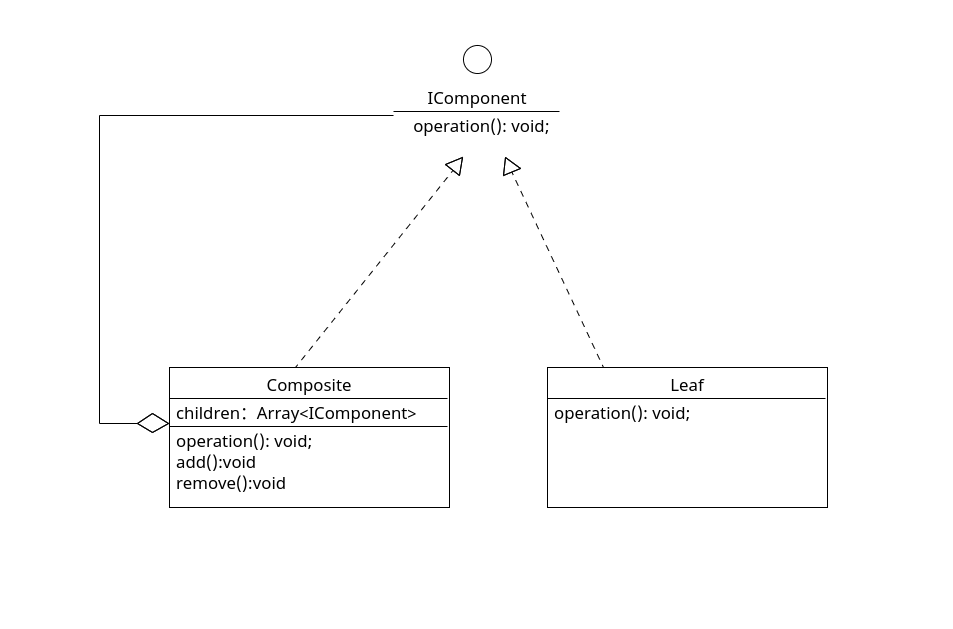

# 组合模式 Composite Pattern

## 定义

组合（Composite Pattern）模式的定义：有时又叫作整体-部分（Part-Whole）模式，它是一种将对象组合成树状的层次结构的模式， 用来表示“整体-部分”的关系，使用户对单个对象和组合对象具有一致的访问性，属于结构型设计模式。

## 角色

1. 抽象构件（Component）角色：它的主要作用是为树叶构件和树枝构件声明公共接口，并实现它们的默认行为。 在透明式的组合模式中抽象构件还声明访问和管理子类的接口；在安全式的组合模式中不声明访问和管理子类的接口， 管理工作由树枝构件完成。（总的抽象类或接口，定义一些通用的方法，比如新增、删除）

2. 树叶构件（Leaf）角色：是组合中的叶节点对象，它没有子节点，用于继承或实现抽象构件。

3. 树枝构件（Composite）角色 /中间构件：是组合中的分支节点对象，它有子节点，用于继承和实现抽象构件。 它的主要作用是存储和管理子部件，通常包含 Add、Remove、GetChild 等方法。

## 类图



## 解释

简单理解为树结构

## 代码案例

```ts
// 抽象构件（Component）角色
export interface IComponent {
  operation(): void;
}

// 树枝构件（Composite）角色 / 中间构件
export class Composite implements IComponent {
  children: Array<IComponent> = [];

  add(item: IComponent) {
    this.children.push(item);
  }

  remove(item: IComponent) {
    this.children = this.children.filter((i) => i === item);
  }

  operation(): void {
    for (const child of this.children) {
      child.operation();
    }
  }
}

// 树叶构件（Leaf）角色
export class Leaf implements IComponent {
  constructor(private name: string) {}

  operation(): void {
    console.log(`${this.name}被调用了`);
  }
}


// client
()=>{
    const composite = new Composite();
    const composite2 = new Composite();

    const leaf = new Leaf('leaf1');
    const leaf2 = new Leaf('leaf2');
    const leaf3 = new Leaf('leaf3');

    composite.add(leaf);
    composite.add(composite2);

    composite.add(leaf2);
    composite.add(leaf3);

    composite.operation();
}()

// leaf1被调用了
// leaf2被调用了
// leaf3被调用了


```
