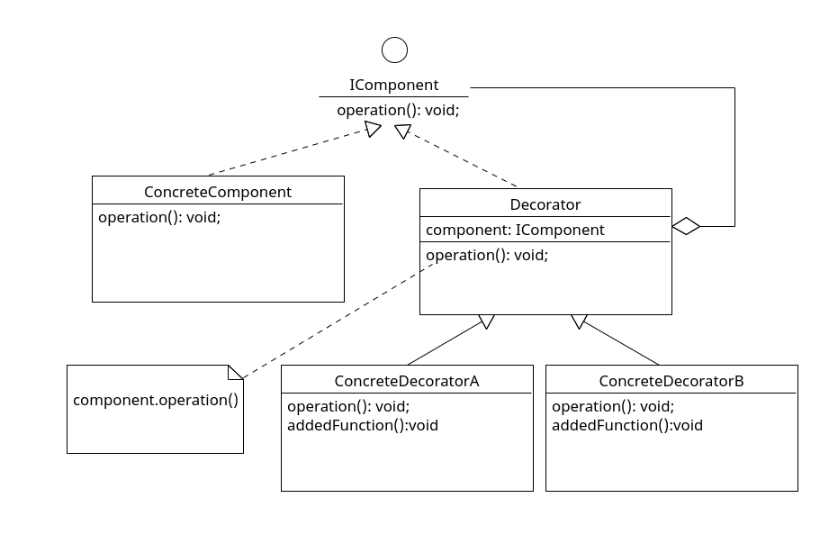

# 装饰器模式 Decorator Pattern

## 定义

装饰器（Decorator）模式的定义: 指在不改变现有对象结构的情况下，动态地给该对象增加一些职责（即增加其额外功能）的模式，它属于对象结构型模式。

## 角色

1. 抽象构件（Component）角色：定义一个抽象接口以规范准备接收附加责任的对象。类图中的`IComponent`
2. 具体构件（ConcreteComponent）角色(被装饰的类)：实现抽象构件，通过装饰角色为其添加一些职责。类图中的`ConcreteComponent`
3. 抽象装饰（Decorator）角色：继承抽象构件，并包含具体构件的实例，可以通过其子类扩展具体构件的功能。类图中的`Decorator`
4. 具体装饰（ConcreteDecorator）角色(具体装饰器/包装类)：实现抽象装饰的相关方法，并给具体构件对象添加附加的责任。类图中的`ConcreteDecoratorA` `ConcreteDecoratorB`

## 类图



## 解释

向一个现有的对象/类中添加新的功能，同时又不改变现有对象/类,首先我们要找到被装饰的类，建立抽象，然后建立装饰类的抽象并要符合被装饰类的结构，另外装饰器类的抽象要保存被装饰类的实例引用，方法要调用被包住的对象的方法。

## 代码案例

```ts
// 抽象构件
interface IComponent {
  operation(): void;
}

//具体构件角色
class ConcreteComponent implements IComponent {
  constructor() {
    console.log('创建具体构件角色');
  }

  public operation() {
    console.log('调用具体构件角色的方法operation()');
  }
}

// 抽象装饰角色
class Decorator implements IComponent {
  private component: IComponent;

  constructor(component: IComponent) {
    this.component = component;
  }

  operation() {
    this.component.operation();
  }
}

//具体装饰角色A
class ConcreteDecoratorA extends Decorator {
  constructor(component: IComponent) {
    super(component);
  }

  override operation() {
    super.operation();
    this.addedFunctionA();
  }

  public addedFunctionA() {
    console.log('为具体构件角色增加额外的功能 addedFunctionA()');
  }
}

//具体装饰角色B
class ConcreteDecoratorB extends Decorator {
  constructor(component: IComponent) {
    super(component);
  }

  override operation() {
    super.operation();
    this.addedFunctionB();
  }

  public addedFunctionB() {
    console.log('为具体构件角色增加额外的功能 addedFunctionB()');
  }
}

// client
()=>{
    const c: IComponent = new ConcreteComponent();
    const da: IComponent = new ConcreteDecoratorA(c);
    const db: IComponent = new ConcreteDecoratorB(da);
    db.operation();
}()

// 创建具体构件角色
// 调用具体构件角色的方法operation()
// 为具体构件角色增加额外的功能 addedFunctionA()
// 为具体构件角色增加额外的功能 addedFunctionB()
```
