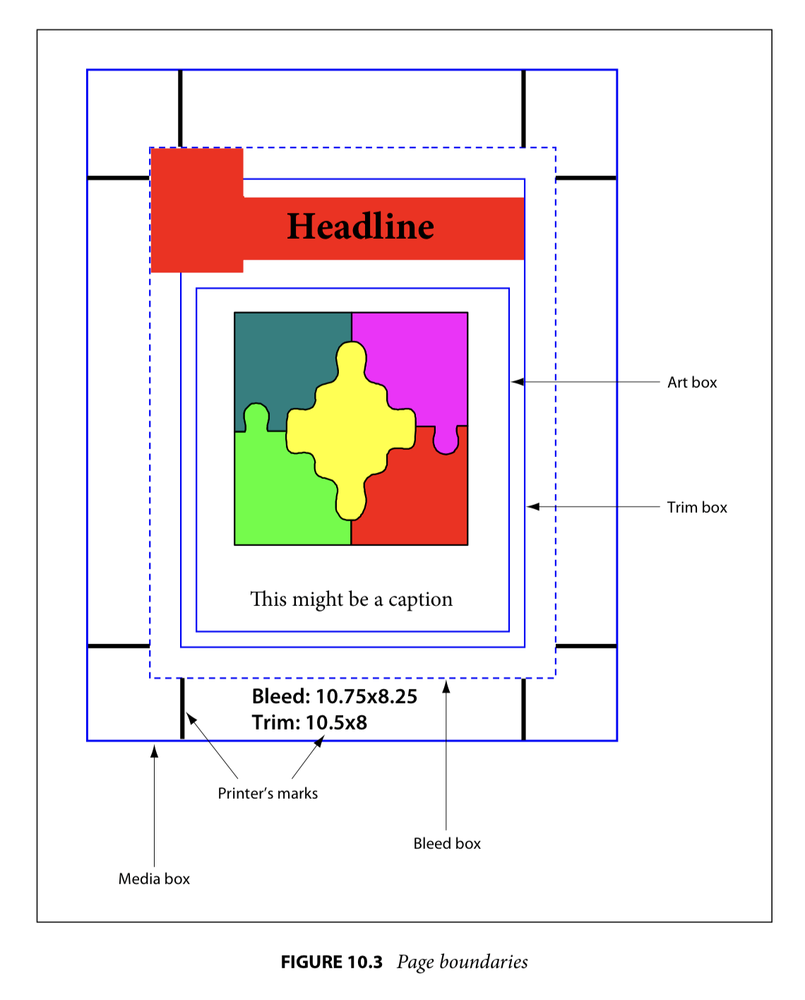

# 面向 web 打印的网页设计

## @media print 查询

响应式设计是通过使用媒体查询实现的：一组 CSS 属性，当你的网页在平板电脑终端、手机、电视屏幕等上呈现时，你可以使用它们来定义样式。
其中一个媒体查询， @media print 是专门用于打印网页的。例如，你可以删除菜单、图标，更改超链接的显示方式等。
作为一个填充，Paged.js 将使用该媒体查询下的 CSS 规则来定义你的书的样式：

```css
@media print {
  /* All your print styles go here */
}
```

如果你不使用 Paged.js，那么这个媒体查询中声明的样式只会在浏览器打印对话框中打印网页(或保存为 PDF)时才应用，
例如，字体大小可能会因屏幕和打印机而异，或者为了节省墨水可能会删除图像(使用 display:none )，
如果你使用 Paged.js，那么你就能在浏览器中预览打印时样式的效果。

## @page 规则

@page 规则允许你指定页面模型的各个方面，比如尺寸、方向、背景、边距、裁剪、注册标志等等，所有影响页面布局的 CSS 属性都必须在其中声明。

## 页面 size 属性

`size`属性指定页面的大小(不包括溢出)。这个固定的大小可以用厘米( cm )、毫米( mm )或英寸( in )来声明。
第一个数字是文档的宽度，第二个数字是高度。默认情况下，Paged.js 使用字号大小(8.5in × 11in)。
还可以使用关键字指定页面大小，这些关键字可以与页面方向( portrait 或 landscape )结合使用。默认情况下，页面总是以纵向打印。

```css
/* 定义一个自定义大小 */
@page {
  size: 140mm 200mm;
}

/* 使用A5纸张 */
@page {
  size: A5;
}

/* 使用A4纸横向 */
@page {
  size: A4 landscape;
}
```

| 界面大小关键字 |          大小 |
| :------------- | ------------: |
| A0             | 841 × 1189 mm |
| A1             |  594 × 841 mm |
| A2             |  420 × 594 mm |
| A3             |  297 × 420 mm |
| A4             |  210 × 297 mm |
| A5             |  148 × 210 mm |
| A6             |  105 × 148 mm |
| A7             |   74 × 105 mm |
| A10            |    26 × 37 mm |
| B4             |  250 × 353 mm |
| B5             |  176 × 250 mm |
| letter         |   8.5 × 11 in |
| legal          |   8.5 × 14 in |
| ledger         |    11 × 17 in |

## CSS 变量

你不能使用 CSS 变量来定义页面大小，因为浏览器不支持。

然而，Paged.js 从你的声明中创建了一组自定义属性，并使用它们来布局。因此，如果你需要它们用于计算，你可以在文档中复用它们：

- `var(--pagedjs-pagebox-width)` 用于设置页面宽度

- `var(--pagedjs-pagebox-height)` 用于设置页面高度

警告：浏览器只能理解文档的一个页面大小。如果您需要创建具有不同页面大小的文档，您将需要创建两个单独的 HTML 文件并生成两个 PDF。

## 边距大小属性

页面的边距需要在 @page 规则中声明，语法与通常使用的边距相同，可以使用像厘米( cm )毫米( mm )，英寸( in )或像素( px )这样的长度单位。

```css
@page {
  margin: 20mm 30mm;
}
```

默认情况下，边距设置为 1 英寸。

其他不同语法的示例：

```css
/* 所有边距为 30mm */
@page {
  margin: 30mm;
}

/* 上下边距 3in,左右边距 2in */
@page {
  margin: 3in 4in;
}

/* 各个不同的边距 */
@page {
  margin-top: 20mm;
  margin-bottom: 25mm;
  margin-left: 10mm;
  margin-right: 35mm;
}
```

## 对页或正反面

自古登堡（西方活字印刷术发明人）以来，书籍的设计考虑了对页：左页和右页通常以折线为轴对称。
如果需要改变，可以在 @page 规则上使用 :left 和 :right 伪选择器，并为页面设置不同的样式。

让我们看一个有不同 margin 的例子：外部页边距比内部页边距大。

```css
@page: left {
  margin-left: 25mm;
  margin-right: 10mm;
}

@page: right {
  margin-left: 10mm;
  margin-right: 25mm;
}
```

如果你的文档是一本正反页的书(即不需要对页)，你可以用同样的方式使用 :recto 和 :verso 页选择器。

## 分页符

当内容无法放入页面时，Paged.js 会自动创建分页符，但你可能需要控制这种分页，比如在书中，你可能希望所有章节都从右页开始，有一些属性可以帮助你做到这一点。

`break-before` 属性表示元素应该从新页面开始，可以是:

- 使用 `break-before: page` 时，元素可以从任何新页开始；
- 元素开始于下一个右页或下一个左页(如果需要，会自动创建一个 `blank` 页)；
- 使用 `break-before: recto` 或 `break-before: verso` 可以替代 `break-before: right` 或 `break-before: left` ；

假设你所有的书章节都在 `<section>` 元素中，并且带有 `chapter` 样式类，你希望你的章节总是从右页开始，你可以这样写：

```css
.chapter {
  break-before: right;
}
```

你也可以在内联元素上使用分页符，例如，下面的代码强制二级标题总是在新页面开始：

```css
h2 {
  break-before: page;
}
```

如果你喜欢，也可以用同样的方式使用 `break-after` ：

- `break-after: page` 将把 元素后面的内容推到下一个页面；
- `break-after: right` 或 `break-after: left` 将把内容推送到下一个右/左页面的元素后面;
- `break-after: recto` 或 `break-after: verso` 会将内容推送到下一个 recto 或 verso 页面的元素之后;

## 页面的伪类选择器

W3C 为特定页面定义了伪类选择器，我们已经见过 `:left` 和 `:right` 选择器，但还有一些其他有用的选择器：

- `:first`，选择文档的第一页
- `nth()` ，让你指定你想选择的页码(例如：`@page:nth(3)` 选择第三页)
- `:blank`，选择文档中的所有空白页(空白页是强制左、右换页的结果)

被伪类选择器匹配的页面也可以被其他页面伪类匹配。应用的规则是根据 CSS 级联原则定义的。

## Bleeds（出血）



为了确保在打印时不会有任何可见的白纸，我们使用 `bleed` 属性，它指定了页面框外溢出的区域的大小，它不会影响页面上内容的空间。

```css
@page {
  bleed: 6mm;
}
```

## 剪切和十字标记

你可以在页面框外添加裁剪标记以便于裁剪，对于专业印刷，也可以添加十字标标记，这些标记用于在印刷过程中对齐纸张。

这两种类型的标记必须添加在相同的 marks 属性中，您可以使用其中一种或两种。

```css
/* crop: 将显示裁切标记。指示应在何处裁切页面
cross: 十字标记将显示。用于对齐纸张 */
@page {
  marks: crop cross;
}

@page {
  marks: crop;
}
```

## 代码回顾

```css
@media print {
  @page {
    size: 140mm 200mm;
    margin: 10mm 15mm;
    bleed: 6mm;
    marks: crop cross;
  }
  @page: left {
    margin-left: 35mm;
    margin-right: 15mm;
  }
  @page: right {
    margin-left: 15mm;
    margin-right: 35mm;
  }
  .chapter {
    break-before: right;
  }
}
```
